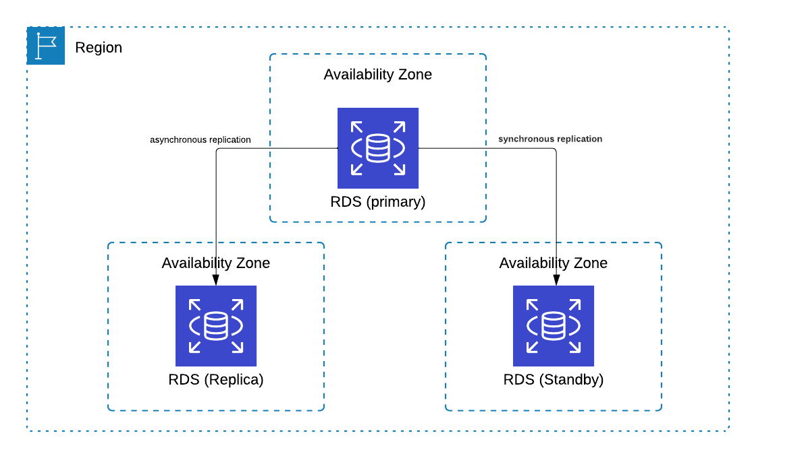
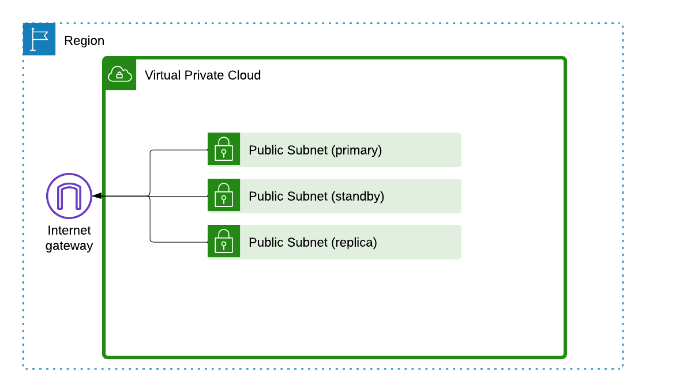

# Terraform AWS RDS with Multi-AZ and Read Replica Setup

This document explains how to deploy an AWS RDS instance using Terraform. It includes a primary RDS instance with high availability across multiple availability zones and a read replica for increased read scalability. The setup also covers creating a VPC, subnets in three availability zones, an Internet Gateway, and routing for internet access.

## Architecture Overview

The setup is divided into two main parts:

1. **RDS Setup**: Managed in the `rds.tf` file, it includes a primary RDS instance with a standby in another availability zone for high availability, and a read replica in a third availability zone for scalability.

2. **Network Setup**: Configured in the `vpc.tf` file, it includes a VPC with three subnets in different availability zones, an Internet Gateway for internet access, and routing configurations.

### Diagrams

- **RDS Architecture**


  

  `rds.tf` creates the RDS setup, including the primary instance, standby instance, and read replica. It also sets up a custom parameter group for writable green deployments, important for schema updates.


- **VPC and Network Architecture**


  

  `vpc.tf` manages the VPC setup, including the subnets, Internet Gateway, and their connections.


## Setup Instructions

### Prerequisites:

- Make sure Terraform is installed on your computer.
- Set up your AWS CLI with the necessary credentials.

  You'll need an AWS Access Key ID and Secret Access Key. Here's how to set them as environment variables:

  #### On Linux or macOS:

  Open a terminal and run these commands, replacing the placeholders with your actual credentials:

  ```sh
  export AWS_ACCESS_KEY_ID="YOUR_ACCESS_KEY_ID"
  export AWS_SECRET_ACCESS_KEY="YOUR_SECRET_ACCESS_KEY"
  ```

## Setup Instructions

### Clone the Repository

- Clone this repository to your local machine to get started.

### Initialize Terraform
- Navigate to the project directory in your terminal. This is where you've cloned the repository. Run the following command to initialize the Terraform environment:

```shell
terraform init
```

### Deploy the Infrastructure
- To see what Terraform plans to do before making any changes to your actual resources, run:
```shell
terraform plan
```
- If everything looks good, apply the changes by running:
```shell
terraform apply
```
- You will be prompted to confirm the action. Type yes to proceed.

### Creating a Blue-Green Deployment

After your infrastructure is set up with Terraform, you're ready to manage a blue-green deployment for your RDS instance. This process involves creating a new version of your database (the "green" environment) while keeping the old version (the "blue" environment) running. Eventually, you'll switch over to the "green" environment. Here's how to do it using the AWS CLI:

#### Step 1: Identify the ARN to Use

From the Terraform output, you'll need the ARN (Amazon Resource Name) of your primary RDS instance. This ARN uniquely identifies your "blue" environment's database instance. When you run `terraform output -json`, look for the `primary_db_arn` value. It should look something like this:

```json
"primary_db_arn": {
  "value": "arn:aws:rds:us-east-1:123456789:db:primary-instance"
}
```
#### Step 2: Prepare the AWS CLI Command

With the ARN of your primary database instance, you're going to create a new deployment. This involves specifying a few parameters:

1. `--blue-green-deployment-name`: A name for your blue-green deployment. This helps you identify it later.
2. `--source`: The ARN of your "blue" environment's database instance. This is what you identified in `Step 1`.
3. `--target-engine-version`: The version of the database engine for the "green" environment.
4. `--target-db-parameter-group-name`: The name of the DB parameter group for the "green" environment. The value we need to set is the name of parameter group we created using Terraform (`rds-allow-write`). 

Here's how you use these parameters in the command:

```shell
aws rds create-blue-green-deployment \
    --blue-green-deployment-name my-blue-green-deployment \
    --source "arn:aws:rds:us-east-1:123456789:db:primary-instance" \
    --target-engine-version "8.0.36" \
    --target-db-parameter-group-name "rds-allow-write"
```

In this command, replace `arn:aws:rds:us-east-1:123456789:db:primary-instance` with the actual ARN you got from the Terraform output.

#### Step 3: Execute the Command
Run the above command in your terminal. It will start the process of creating your "green" environment. The command will output information in JSON format, including a `BlueGreenDeploymentIdentifier`. This identifier is crucial for the next steps, especially when you're ready to switch over to the "green" environment.


### Switchover to the "Green" Environment
After your "green" environment is set up and ready, the next step is to switch over from the "blue" environment. This process involves using the AWS CLI to initiate the switchover, utilizing the `BlueGreenDeploymentIdentifier` you received from creating the blue-green deployment.

#### Step 1: Retrieve the `BlueGreenDeploymentIdentifier`
When you created the blue-green deployment, the AWS CLI command output included a `BlueGreenDeploymentIdentifier`. You need this identifier for the switchover process. It looks something like this in the command output:

```json
{
  "BlueGreenDeployment": {
    "BlueGreenDeploymentIdentifier": "bgd-01abcdefg23456789",
    ...
  }
}
```
Copy the `BlueGreenDeploymentIdentifier` value (`bgd-01abcdefg23456789` in this example).

#### Step 2: Prepare the Switchover Command
With the `BlueGreenDeploymentIdentifier`, you're ready to initiate the switchover. The AWS CLI command for this operation requires the following parameters:

1. `--blue-green-deployment-identifier`: The identifier of the blue-green deployment you're switching over.
2. `--switchover-timeout`: The amount of time, in seconds, AWS RDS should wait for the switchover to complete before timing out. Here's the command structure:

```shell
aws rds switchover-blue-green-deployment \
    --blue-green-deployment-identifier bgd-01abcdefg23456789 \
    --switchover-timeout 600
```

Replace `bgd-01abcdefg23456789` with your actual `BlueGreenDeploymentIdentifier`.

#### Step 3: Execute the Switchover Command
Run the prepared command in your terminal. This command tells AWS RDS to start the process of switching your database connections from the "blue" environment to the "green" environment.

#### Monitoring the Switchover Process
You can monitor the progress of the switchover in the AWS Management Console or by using additional AWS CLI commands to query the status of your blue-green deployment. It's crucial to ensure the switchover completes successfully and that your "green" environment is fully operational.